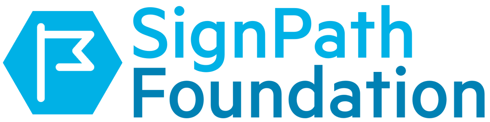

<div align="center">


# LunaBox

**Lightweight, fast, and feature-rich visual novel management and game statistics tool**

[中文](README.zh-CN.md) | [English](README.md) | [日本語](README.ja.md)

[](https://go.dev/)
[](https://wails.io/)
[](https://react.dev/)

</div>

<p align="center">
  <a href="https://github.com/Saramanda9988/LunaBox/releases">
    
  </a>
  <a href="http://qm.qq.com/cgi-bin/qm/qr?_wv=1027&k=Eq5DkGu1gs6tL9bUEJFiq46r6czdpQaR&authKey=w1NRtvE8fYAgShdzGFGx4QDaKQyJRypgHOrVMOhxK5cjUbGt4TXu4px2L%2FJem2WN&noverify=0&group_code=1094948837" target="_blank">
    
  </a>
  <a href="https://t.me/+6YTPdl-6YeM1OGNl" target="_blank">
    
  </a>
</p>

## ✨ Features

- **Game category management** - Organize your library with custom categories
- **Playtime tracking** - Automatically track session time when launching games
- **Small binary footprint** - Built with Wails, no full browser runtime bundled
- **Multi-dimensional statistics** - View play data by day/week/month/year and export shareable stat cards
- **AI insights** - Analyze gameplay data to generate personalized, playful reports, with MCP exposure and CLI skill support for broader data-use scenarios
- **Convenient data import** - Import from PotatoVN, Playnite, and Vnite; supports folder batch import and drag-and-drop
- **Multi-channel backup** - Local backup, AWS S3, Qiniu, Alibaba Cloud OSS (S3-compatible), and OneDrive backup
- **Cloud sync (beta)** - Sync data across devices and access your library and play statistics anytime, anywhere
- **CLI Mode** - Support for managing, launching, and backing up games, and modifying program data via command line
- **Privacy and security** - All sensitive data is stored locally

## Screenshots

<details>
<summary>Click to view more custom background styles</summary>


</details>

<details>
<summary>Click to view stat export poster templates</summary>


</details>

Additional in-app screenshots (located in the `screenshot/` directory):


## 🛠️ Tech Stack

| Layer | Technology |
|------|------|
| **Framework** | [Wails v2](https://wails.io/) |
| **Backend** | [Go 1.24](https://go.dev/) |
| **Frontend** | [React 18](https://react.dev/) + [TypeScript](https://www.typescriptlang.org/) |
| **Database** | [DuckDB](https://duckdb.org/) |
| **Build Tool** | [Vite](https://vitejs.dev/) |
| **Styling** | [UnoCSS](https://unocss.dev/) |
| **Routing** | [TanStack Router](https://tanstack.com/router) |
| **State Management** | [Zustand](https://zustand-demo.pmnd.rs/) |
| **Charts** | [Chart.js](https://www.chartjs.org/) + [react-chartjs-2](https://react-chartjs-2.js.org/) |

## 📦 Installation

### Download from Releases

Go to the [Releases](https://github.com/Saramanda9988/LunaBox/releases) page and download the latest installer.

### Build from source

#### Prerequisites

- [Go 1.24+](https://go.dev/dl/)
- [Node.js 18+](https://nodejs.org/)
- [pnpm](https://pnpm.io/)
- [Wails CLI](https://wails.io/docs/gettingstarted/installation)
- [msys2](https://www.msys2.org/)
- [NSIS](https://nsis.sourceforge.io/Main_Page)

```bash
# Install Wails CLI
go install github.com/wailsapp/wails/v2/cmd/wails@latest
```

#### Build steps

```bash
# Clone project
git clone https://github.com/Saramanda9988/lunabox.git
cd lunabox

# Install frontend dependencies
cd frontend && pnpm install && cd ..

# Run in development mode
wails dev

# Build production version
wails build

# Build locally using script (Windows)
.\scripts\build.bat all 1.0.0-beta
```

## 🤝 Contributing

Issues and Pull Requests are welcome.

## 🗺️ Roadmap

- [x] Improve logging system
- [ ] Support importing data from ReinaManager
- [ ] Self-hosted Docker server
- [ ] IM platform bot plugin
- [x] Multi-device synchronization
- [ ] Gallery feature
- [x] Expose MCP and provide link-based game launch capability for AI
- [ ] "What to play next" recommendation feature
- [ ] Support Linux/macOS platform
- [ ] Support Korean/Traditional Chinese and other languages

## 😀 From Open Source to Open Source

Inspiration:

- [PotatoVN](https://github.com/GoldenPotato137/PotatoVN) - Galgame 管理工具
- [ReinaManager](https://github.com/huoshen80/ReinaManager) - 一款轻量化的galgame和视觉小说管理工具
- [Playnite](https://github.com/JosefNemec/Playnite) - An open source video game library manager with one simple goal: to provide a unified interface for all of your games
- [Vnite](https://github.com/ximu3/vnite) - A unified platform to organize your game collection, track gameplay, with real-time cloud sync across devices and detailed gameplay reports

## 🙏 Acknowledgements

Game metadata APIs:

- [Bangumi](https://github.com/bangumi) - Bangumi番组计划
- [VNDB](https://vndb.org/) - The Visual Novel Database
- [月幕gal](https://www.ymgal.games/) - 请感受这绝妙的文艺体裁
- [萌娘百科](https://zh.moegirl.org.cn/) - 万物皆可萌的百科全书
- [Steam](https://store.steampowered.com/) - The world's largest digital game distribution platform

Archive extraction support:

- [7-Zip](https://www.7-zip.org/) - A free and open-source file archiver, a utility used to place groups of files within compressed containers known as "archives".

Code signing support:

<a href="https://about.signpath.io/product/open-source">
  
</a>

- SignPath - Free code signing provided by [SignPath.io](https://about.signpath.io/product/open-source), certificate by [SignPath Foundation](https://signpath.org/).

## 📄 License

This project is licensed under [AGPL v3](LICENSE).

<div align="center">


</div>
